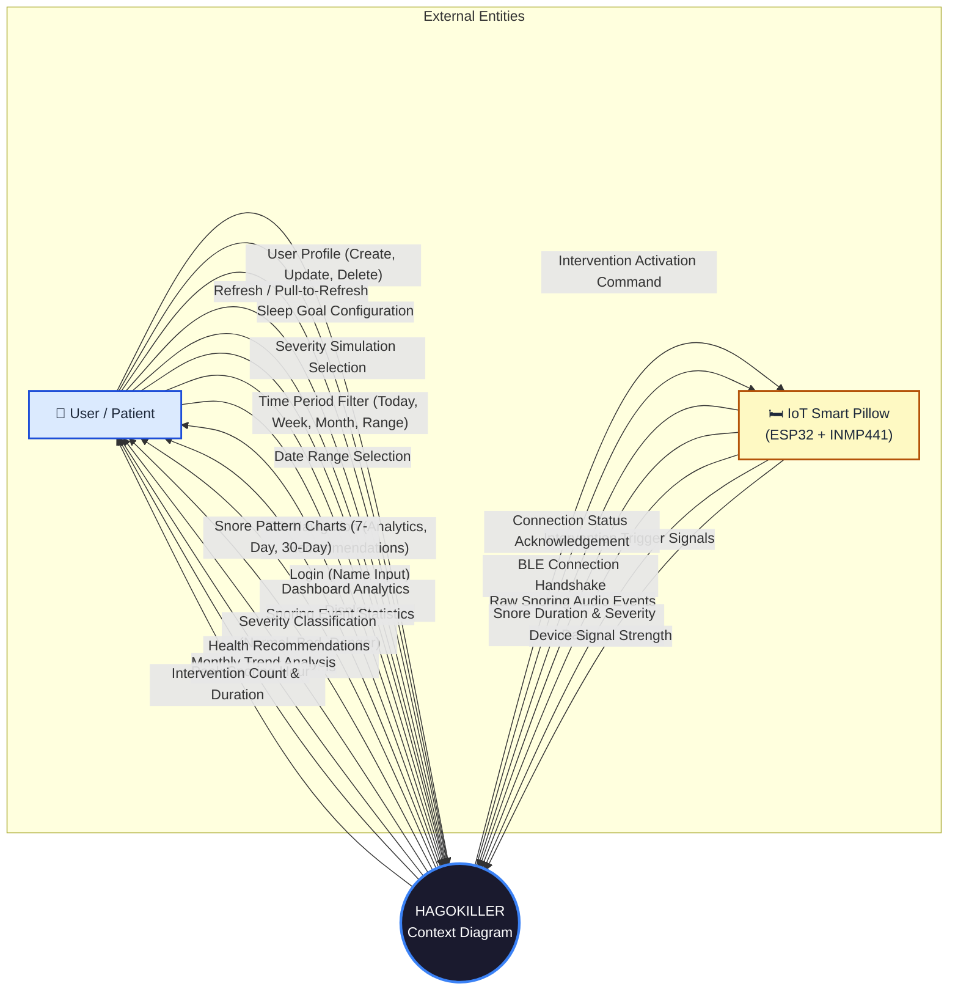
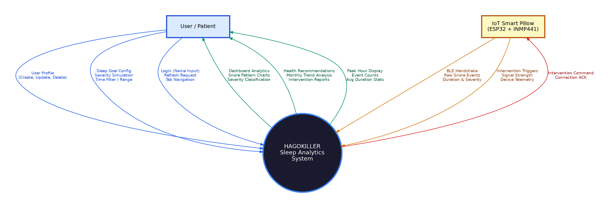
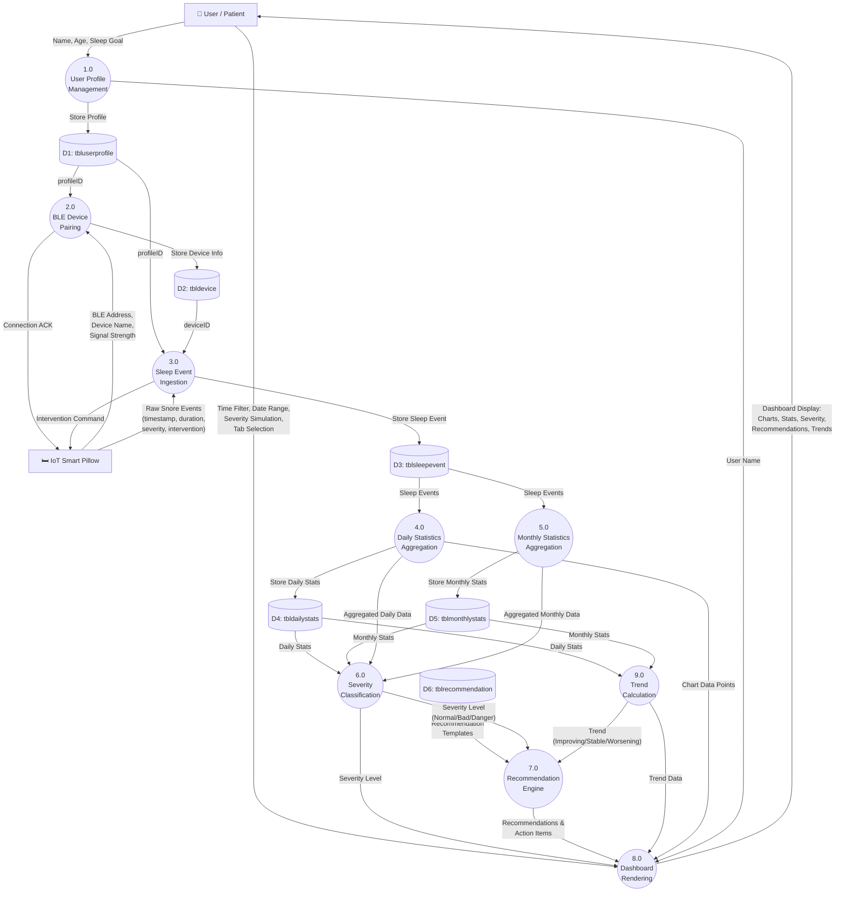
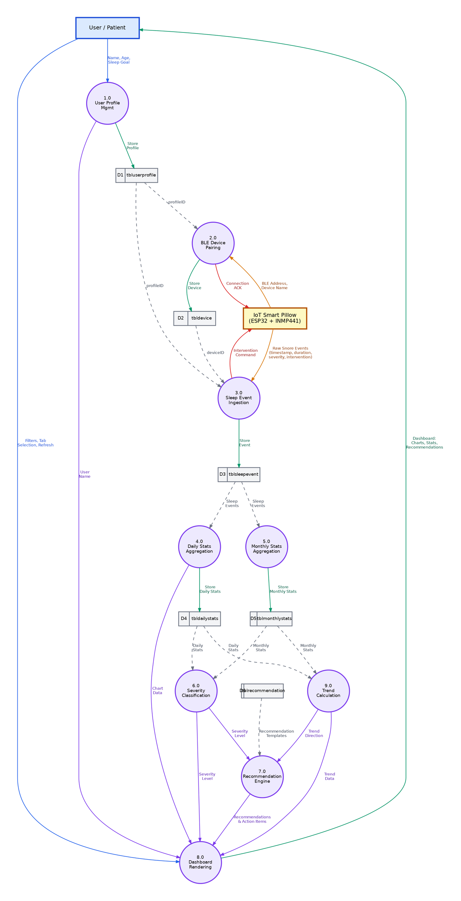
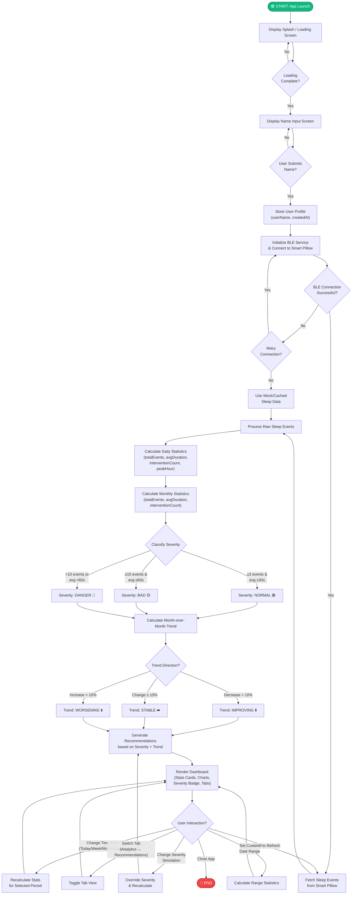
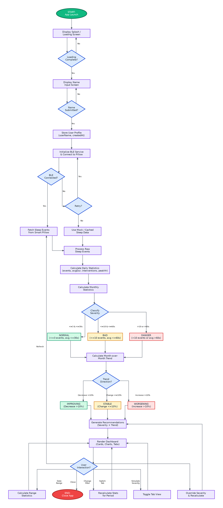
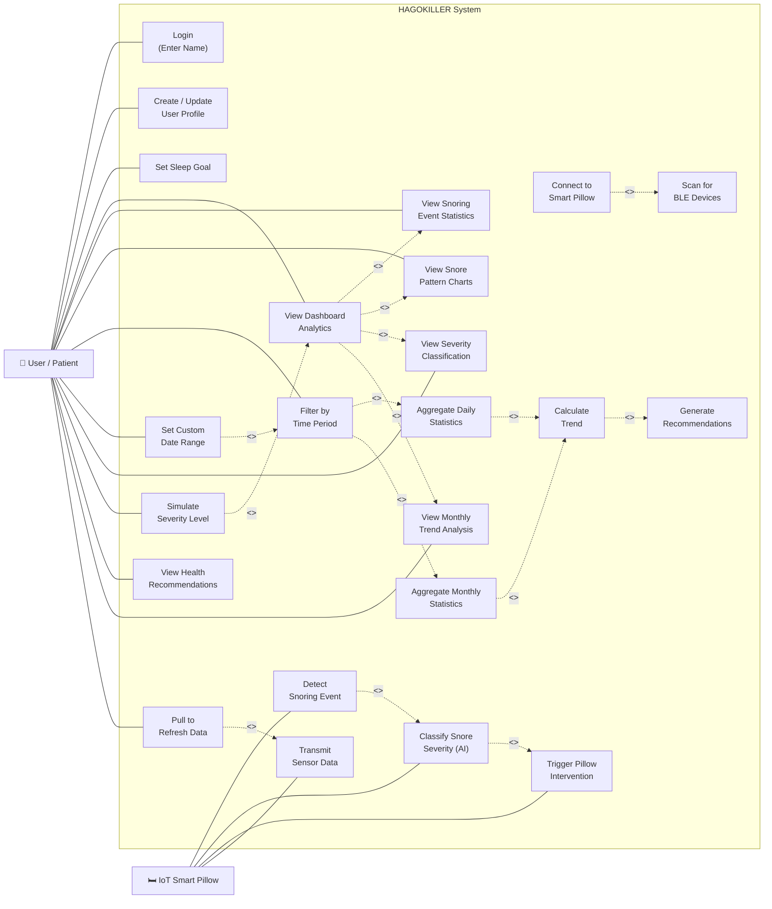
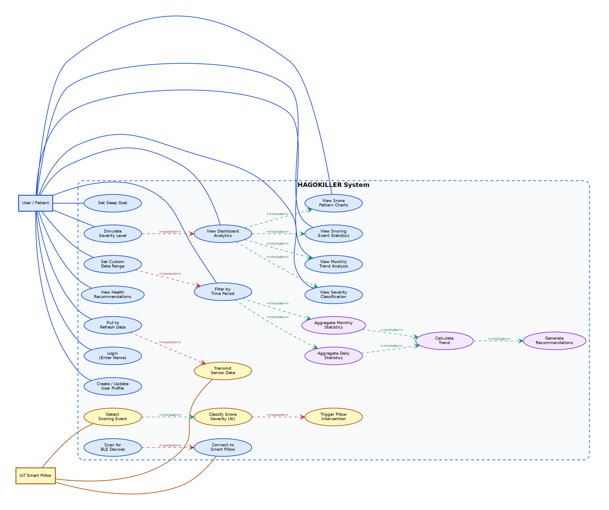

# HAGOKILLER: System Diagrams Documentation

This document provides the complete set of system-level diagrams for the **HAGOKILLER Smart Pillow Sleep Analytics System**. Each section contains a **Mermaid diagram** (renderable in GitHub/VS Code), a thorough **discussion and explanation**, and the corresponding **Graphviz DOT code** that can be pasted into [Graphviz Online](https://dreampuf.github.io/GraphvizOnline/) to generate high-quality images.

---

## 4.5.1 Context Diagram

### Diagram (Mermaid)

### Discussion and Explanation

The **Context Diagram** (also called a Level 0 DFD) provides the highest-level view of the HAGOKILLER system. It shows the system as a single process bubble and identifies all **external entities** that interact with it, along with the **data flows** crossing the system boundary.

#### External Entities

1. **User / Patient**
   - The primary human actor who interacts with the HAGOKILLER mobile application. The user creates a profile by inputting their name, configures sleep goals (e.g., 8 hours of sleep per night), and navigates through the dashboard interface. The user receives computed analytics, severity classifications, chart visualizations, health-based recommendations, and trend reports generated from aggregated snoring data.
   - **Inbound data flows** include profile creation data, sleep goal values, severity simulation selections (used for demo/testing purposes), time period filter choices (Today, Week, Month, Custom Range), date range specifications, pull-to-refresh triggers, and tab navigation commands.
   - **Outbound data flows** include the fully computed dashboard display (snoring event counts, average durations, intervention counts, peak snoring hours), 7-day and 30-day pattern charts, severity classification labels (Normal, Bad, or Danger), personalized health recommendations with actionable items, and month-over-month trend analysis (Improving, Stable, or Worsening).

2. **IoT Smart Pillow (ESP32 + INMP441)**
   - The hardware external entity consisting of an ESP32 microcontroller equipped with an INMP441 digital MEMS microphone. This device performs real-time acoustic monitoring during sleep, classifies snoring intensity using an on-device Edge AI model, and activates a physical air-inflation intervention mechanism to gently reposition the user's head when snoring severity exceeds configured thresholds.
   - **Inbound data flows** from the pillow include BLE (Bluetooth Low Energy) connection handshake signals, raw snoring event data (timestamped with millisecond precision), computed snore duration and severity classification (low, medium, high), intervention trigger flags (whether the air bag inflated), and device telemetry such as signal strength and connection status.
   - **Outbound data flows** to the pillow include intervention activation commands (instructing the pillow to inflate its air mechanism) and connection status acknowledgements (confirming the BLE link is established).

#### System Boundary

The central process bubble labeled **"HAGOKILLER Context Diagram"** encapsulates the entire mobile application logic, including:
- User profile management and local storage (SQLite/AsyncStorage)
- BLE device pairing and communication management
- Sleep event ingestion and persistent logging
- Daily and monthly statistics aggregation
- Severity classification engine (threshold-based: Normal ≤ 3 events, Bad ≤ 10 events, Danger > 10 events)
- Recommendation generation engine
- Dashboard rendering with charts and analytics
- Trend calculation across multiple months

The context diagram deliberately abstracts away all internal processing to focus on **what data enters and exits** the system boundary, establishing the scope of the HAGOKILLER system for stakeholders and developers.

---

### Graphviz DOT Code — Context Diagram

Copy the code below into [Graphviz Online](https://dreampuf.github.io/GraphvizOnline/) to render:

---

## 4.5.2 Data Flow Diagram (Level 1 DFD)

### Diagram (Mermaid)

### Discussion and Explanation

The **Level 1 Data Flow Diagram** decomposes the single HAGOKILLER process bubble from the Context Diagram into its constituent sub-processes. It reveals **how data moves** through the internal system — from external entities, through processing stages, into and out of data stores, and ultimately back to the user.

#### Processes

1. **Process 1.0 — User Profile Management**
   - **Function**: Handles the creation, updating, and retrieval of user profiles. When the user first opens the application, they enter their name via the `NameInputScreen`. This process stores the profile data (userName, age, sleepGoalHours, timestamps) into `D1: tbluserprofile`.
   - **Input**: Name, age, and sleep goal from the User.
   - **Output**: The stored `profileID` is passed to Process 2.0 (Device Pairing) and Process 3.0 (Event Ingestion) as a foreign key reference, ensuring all subsequent data is linked to the correct user. The user's display name is also forwarded to Process 8.0 for dashboard greeting rendering.

2. **Process 2.0 — BLE Device Pairing**
   - **Function**: Manages the Bluetooth Low Energy handshake with the ESP32-based Smart Pillow hardware. The `MockBLEService.connect()` method simulates this process, establishing a communication channel for real-time sensor data transmission.
   - **Input**: BLE address, device name, and signal strength telemetry from the IoT Smart Pillow.
   - **Output**: Device metadata is persisted in `D2: tbldevice`. A connection acknowledgement is sent back to the pillow. The `deviceID` is forwarded to Process 3.0 so that each sleep event can be attributed to the correct hardware unit.

3. **Process 3.0 — Sleep Event Ingestion**
   - **Function**: The core data capture process. It receives raw acoustic snoring events from the smart pillow — each containing a Unix timestamp (millisecond precision), duration in seconds, severity classification from the Edge AI model (low/medium/high), and a boolean flag indicating whether the pillow's air-inflation intervention was triggered.
   - **Input**: Raw event packets from the Smart Pillow; `profileID` from Process 1.0; `deviceID` from Process 2.0.
   - **Output**: Each event is stored as a row in `D3: tblsleepevent`. The accumulated events in this store feed into both Process 4.0 and Process 5.0 for aggregation. If a critical snoring event is detected, an intervention command is sent back to the pillow.

4. **Process 4.0 — Daily Statistics Aggregation**
   - **Function**: Queries `D3: tblsleepevent` for a given calendar date (formatted as `YYYY-MM-DD`), then computes: total snore event count, average snore duration, total intervention count, and the peak snoring hour (the clock hour with the most events). This is implemented in `calculateDailyStats()`.
   - **Input**: Raw sleep events from `D3`.
   - **Output**: A `DailyStats` record written to `D4: tbldailystats`. The aggregated data flows to Process 6.0 for severity classification and to Process 8.0 for chart rendering (the 7-day and 30-day pattern charts).

5. **Process 5.0 — Monthly Statistics Aggregation**
   - **Function**: Aggregates all sleep events within a given month (`YYYY-MM` format) to produce monthly totals. Implemented in `calculateMonthlyStats()`.
   - **Input**: Raw sleep events from `D3`.
   - **Output**: A `MonthlyStats` record stored in `D5: tblmonthlystats`. This feeds Process 6.0, Process 9.0 (for trend comparison between months), and Process 8.0 (for the Monthly Trend section of the dashboard).

6. **Process 6.0 — Severity Classification**
   - **Function**: Applies threshold rules to classify the user's snoring condition:
     - **Normal**: ≤ 3 events/day AND average duration ≤ 30 seconds
     - **Bad**: ≤ 10 events/day AND average duration ≤ 60 seconds
     - **Danger**: > 10 events/day OR average duration > 60 seconds
   - This is implemented in `calculateDailySeverity()` and `calculateMonthlySeverity()`.
   - **Input**: Aggregated daily and monthly statistics from Processes 4.0 and 5.0.
   - **Output**: A severity label (`normal`, `bad`, or `danger`) forwarded to Process 7.0 (to select appropriate recommendations) and Process 8.0 (to render severity badges and color-coded indicators).

7. **Process 7.0 — Recommendation Engine**
   - **Function**: Maps the severity classification and trend data to a catalog of health recommendations stored in `D6: tblrecommendation`. Each severity level triggers a distinct set of actionable advice — ranging from general wellness tips (Normal) to urgent medical referral warnings (Danger).
   - **Input**: Severity level from Process 6.0; trend direction from Process 9.0; recommendation templates from `D6`.
   - **Output**: A structured `RecommendationData` object (containing the recommendation text, action items array, and trend message) forwarded to Process 8.0 for display on the Recommendations tab.

8. **Process 8.0 — Dashboard Rendering**
   - **Function**: The presentation layer process that assembles all computed data into the user-facing mobile interface. It renders the greeting header, severity badge, stats cards (Snoring Events, Avg Duration, Interventions, Peak Hour), snore pattern charts, monthly trend rows, and the recommendations card.
   - **Input**: User name from Process 1.0; severity level from Process 6.0; recommendations from Process 7.0; trend data from Process 9.0; chart data points from Process 4.0; user interaction inputs (time filters, date ranges, tab selections, severity simulator, refresh triggers).
   - **Output**: The complete dashboard display rendered on the user's mobile screen, including all analytics, charts, recommendations, and trend visualizations.

9. **Process 9.0 — Trend Calculation**
   - **Function**: Compares monthly statistics across two or more consecutive months to determine the overall direction of the user's snoring pattern. A decrease of more than 10% in average daily events signals "Improving"; an increase of more than 10% signals "Worsening"; otherwise "Stable". Implemented in `calculateTrend()`.
   - **Input**: Monthly statistics from `D5: tblmonthlystats`.
   - **Output**: A trend label (`improving`, `stable`, or `worsening`) forwarded to Process 7.0 (to customize the trend message in recommendations) and Process 8.0 (to render the trend badge and monthly comparison arrows).

#### Data Stores

| Store | Name | Description |
|:------|:-----|:------------|
| D1 | `tbluserprofile` | User identity, demographics, sleep goals, and audit timestamps. |
| D2 | `tbldevice` | Paired BLE smart pillow metadata (device name, BLE MAC address, connection status, signal strength). |
| D3 | `tblsleepevent` | Individual snoring event records with timestamps, durations, severity classifications, and intervention flags. |
| D4 | `tbldailystats` | Pre-aggregated daily statistics for fast chart rendering and severity calculation. |
| D5 | `tblmonthlystats` | Pre-aggregated monthly statistics for long-term trend tracking. |
| D6 | `tblrecommendation` | Static recommendation catalog mapping severity levels to health advice templates. |

---

### Graphviz DOT Code — Data Flow Diagram

---

## 4.5.3 Flowchart

### Diagram (Mermaid)

### Discussion and Explanation

The **Flowchart** illustrates the complete operational flow of the HAGOKILLER application from the moment a user launches it to the moment they close it. It captures every decision point, processing step, and user interaction loop.

#### Phase 1: Application Initialization (Startup Sequence)

1. **App Launch → Splash Screen**: When the user opens the HAGOKILLER app, `SplashScreen.preventAutoHideAsync()` is called to hold the native splash screen, followed immediately by the custom `LoadingScreen` component rendering an animated loading state with the HAGOKILLER branding.

2. **Loading Complete Check**: The loading screen runs a timed animation (approximately 3 seconds). Once complete, the `onLoadingComplete` callback transitions the app state from `'loading'` to `'name-input'`.

3. **Name Input**: The `NameInputScreen` renders a text input field prompting the user to enter their name. The user must type at least one character and press the continue button. This establishes the user profile for personalized greetings.

4. **Profile Storage**: Upon submission, the user's name is stored in the component state (and would be persisted to `tbluserprofile` in a production deployment). The app state transitions to `'dashboard'`.

#### Phase 2: Data Acquisition (BLE + Event Fetching)

5. **BLE Service Initialization**: The `MockBLEService` class is instantiated. In production, this would scan for nearby ESP32 BLE devices, establish a GATT connection, and subscribe to snoring event characteristic notifications.

6. **Connection Decision Point**: If the BLE connection succeeds, the app proceeds to fetch sleep events. If it fails, the user is given the option to retry or fall back to cached/mock data for demonstration purposes.

7. **Fetch Sleep Events**: The `fetchSleepEvents()` method retrieves the complete event history (up to 90 days of simulated data in the mock implementation). Each event contains: `id`, `timestamp`, `duration`, `severity`, `interventionTriggered`, and `interventionDuration`.

#### Phase 3: Data Processing Pipeline

8. **Daily Statistics Calculation**: For each calendar day, the `calculateDailyStats()` function filters events by date and computes: total snore event count, average snore duration, intervention activation count, and peak snoring hour (the hour with the highest event frequency).

9. **Monthly Statistics Calculation**: `calculateMonthlyStats()` aggregates events within a calendar month to produce monthly totals for event counts, average durations, and intervention counts.

10. **Severity Classification**: The threshold-based classifier evaluates the daily event count and average duration:
    - **Normal** (🟢): ≤ 3 events AND average duration ≤ 30 seconds — the user's snoring is within healthy limits.
    - **Bad** (🟡): ≤ 10 events AND average duration ≤ 60 seconds — elevated snoring requiring lifestyle adjustments.
    - **Danger** (🔴): > 10 events OR average duration > 60 seconds — critical snoring levels requiring medical evaluation.

11. **Trend Calculation**: `calculateTrend()` compares the two most recent monthly statistics to determine the direction of change. A decrease greater than 10% indicates "Improving"; an increase greater than 10% indicates "Worsening"; otherwise the pattern is "Stable".

12. **Recommendation Generation**: Based on the severity level and trend direction, `getRecommendations()` produces a structured advice object with a recommendation summary, an ordered list of actionable health items, and a trend-specific motivational or warning message.

#### Phase 4: Dashboard Rendering & User Interaction Loop

13. **Dashboard Rendering**: The `DashboardScreen` assembles all processed data into the mobile UI:
    - Header with greeting and severity badge
    - Severity simulation dropdown (for demo/testing)
    - Time period filter bar (Today, Week, Month, Range)
    - Tab bar (Analytics | Recommendations)
    - Stats cards grid (4 key metrics)
    - Snore pattern chart (line graph)
    - Monthly trend comparison rows
    - Footer with sync status and medical disclaimer

14. **User Interaction Loop**: The dashboard is fully interactive. Users can:
    - **Change Time Filter**: Selecting a different period (Today, Week, Month, Custom Range) recalculates statistics for that window and updates the chart.
    - **Simulate Severity**: The dropdown allows testing different severity scenarios, overriding the computed severity for demonstration.
    - **Switch Tabs**: Toggling between Analytics and Recommendations views.
    - **Pull-to-Refresh**: Re-fetches sleep events from the BLE service and reprocesses all data.
    - **Set Custom Date Range**: Specifies a from/to date for targeted analysis.
    - **Close App**: Terminates the session.

---

### Graphviz DOT Code — Flowchart

---

## 4.5.4 Use Case Diagram

### Diagram (Mermaid)

### Discussion and Explanation

The **Use Case Diagram** identifies all the functional capabilities of the HAGOKILLER system from the perspective of its two primary actors, and defines the relationships between use cases using UML stereotypes (`<<include>>` and `<<extend>>`).

#### Actors

1. **User / Patient (👤)**
   - The human end-user who interacts with the HAGOKILLER mobile application. This actor represents anyone using the smart pillow system to monitor their snoring patterns and receive health insights. The user's primary goals are to track their sleep quality, understand their snoring severity, and receive actionable health recommendations.

2. **IoT Smart Pillow (🛏️)**
   - The hardware actor — the ESP32-based smart pillow with embedded INMP441 microphones and an Edge AI classifier. This actor autonomously detects snoring events, classifies their severity, and transmits sensor data to the mobile application via Bluetooth Low Energy. It also physically intervenes by inflating an internal air mechanism when critical snoring is detected.

#### Use Cases — User Actor

| # | Use Case | Description |
|:--|:---------|:------------|
| UC1 | **Login (Enter Name)** | The user enters their name on the NameInputScreen to create a session identity. This is the first interaction upon app launch and personalizes the dashboard greeting. |
| UC2 | **Create / Update User Profile** | The user establishes their profile with demographics (name, age) and preferences. Profile data is persisted in `tbluserprofile` for session continuity. |
| UC3 | **Set Sleep Goal** | The user configures their target sleep duration (e.g., 8 hours/night). This value is used to calculate sleep quality scores and generate contextual recommendations. |
| UC6 | **View Dashboard Analytics** | The primary use case. The user views the complete analytics dashboard including stats cards, pattern charts, severity badges, and trend reports. This **includes** UC7, UC8, UC11, and UC14 as mandatory sub-use-cases. |
| UC7 | **View Snoring Event Statistics** | The user views the four key metric cards: total snoring events, average duration (seconds), intervention count, and peak snoring hour. |
| UC8 | **View Snore Pattern Charts** | The user views the line chart visualization showing snoring event distribution across the selected time period (7-day or 30-day patterns). |
| UC9 | **Filter by Time Period** | The user selects a time window (Today, Week, Month, Custom Range) to scope the displayed analytics. This **includes** UC20 and UC21 since changing the filter triggers statistical recalculation. |
| UC10 | **Set Custom Date Range** | The user specifies explicit from/to dates for targeted analysis. This **extends** UC9 as an optional, more granular alternative to preset filters. |
| UC11 | **View Severity Classification** | The user views their computed severity level (Normal 🟢, Bad 🟡, or Danger 🔴) displayed as a color-coded badge in the header and throughout the dashboard. |
| UC12 | **Simulate Severity Level** | The user manually selects a severity level from the dropdown simulator to preview how the dashboard and recommendations change under different conditions. This **extends** UC6 as an optional testing/demo feature. |
| UC13 | **View Health Recommendations** | The user switches to the Recommendations tab to view severity-specific health advice, actionable items (e.g., "Schedule appointment with sleep specialist"), and trend-based motivational messages. |
| UC14 | **View Monthly Trend Analysis** | The user views the monthly comparison section showing event counts per month, severity badges, directional arrows (↑↓), and the overall trend label (Improving/Stable/Worsening). |
| UC15 | **Pull to Refresh Data** | The user pulls down on the scroll view to trigger a data refresh. This **extends** UC19 by requesting the smart pillow to retransmit the latest sensor data. |

#### Use Cases — IoT Smart Pillow Actor

| # | Use Case | Description |
|:--|:---------|:------------|
| UC4 | **Connect to Smart Pillow** | Establishes a BLE connection between the mobile app and the ESP32 hardware. **Extended by** UC5 (Scan for BLE Devices) which optionally scans for available nearby devices before connecting. |
| UC5 | **Scan for BLE Devices** | Scans the Bluetooth environment for available ESP32 smart pillow devices. This is an optional step that extends UC4. |
| UC16 | **Detect Snoring Event** | The smart pillow's INMP441 microphone captures acoustic signals during sleep and identifies snoring episodes. This **includes** UC17 (Classify Snore Severity) as a mandatory follow-up step. |
| UC17 | **Classify Snore Severity (AI)** | The ESP32's Edge AI model classifies each detected snoring event into severity levels (low, medium, high) based on acoustic characteristics. This **extends** to UC18 (Trigger Pillow Intervention) when severity exceeds the threshold. |
| UC18 | **Trigger Pillow Intervention** | When snoring severity is classified as high, the smart pillow activates its air-inflation mechanism to gently reposition the user's head. This is a conditional extension of UC17. |
| UC19 | **Transmit Sensor Data** | The smart pillow transmits collected snoring event data (timestamps, durations, severity classifications, intervention flags) to the mobile app over the BLE connection. |

#### System-Internal Use Cases

| # | Use Case | Description |
|:--|:---------|:------------|
| UC20 | **Aggregate Daily Statistics** | The system processes raw sleep events to compute daily totals (event count, average duration, intervention count, peak hour). **Included by** UC9 when the user changes the time filter. |
| UC21 | **Aggregate Monthly Statistics** | The system compiles monthly aggregates from event data. **Included by** UC9 and **includes** UC22. |
| UC22 | **Calculate Trend** | Compares consecutive monthly statistics to determine the improvement/deterioration direction. **Included by** UC20 and UC21, and **includes** UC23. |
| UC23 | **Generate Recommendations** | Maps the computed severity level and trend direction to a catalog of health recommendations. **Included by** UC22. |

#### Use Case Relationships

- **`<<include>>`** (mandatory composition): UC6 always includes UC7, UC8, UC11, UC14 — viewing the dashboard inherently displays all analytics sub-components. UC16 always includes UC17 — detecting a snoring event always triggers AI classification.
- **`<<extend>>`** (optional extension): UC12 extends UC6 — severity simulation is an optional testing feature. UC10 extends UC9 — custom date ranges are an optional alternative to preset filters. UC17 extends to UC18 — intervention is only triggered when severity warrants it.

---

### Graphviz DOT Code — Use Case Diagram

---

## Summary of Diagrams

| Diagram | Purpose | Section |
|:--------|:--------|:--------|
| **Context Diagram** | Identifies external entities (User, Smart Pillow) and all data flows crossing the system boundary | 4.5.1 |
| **Data Flow Diagram** | Decomposes the system into 9 internal processes, 6 data stores, and traces data movement through the processing pipeline | 4.5.2 |
| **Flowchart** | Maps the complete operational flow from app launch through data processing to the interactive dashboard loop | 4.5.3 |
| **Use Case Diagram** | Catalogs 23 functional use cases across 2 actors with `<<include>>` and `<<extend>>` relationships | 4.5.4 |

---

> **Rendering Instructions**: 
> - **Mermaid diagrams** render natively in GitHub, GitLab, VS Code (with Mermaid extension), and most modern markdown viewers.
> - **Graphviz DOT code** can be pasted into [Graphviz Online](https://dreampuf.github.io/GraphvizOnline/) or rendered locally using `dot -Tpng input.dot -o output.png`.
