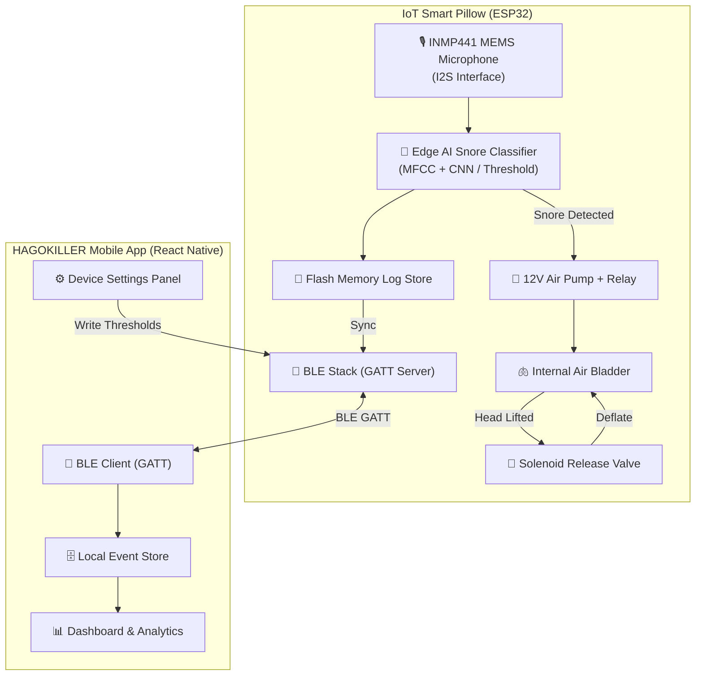
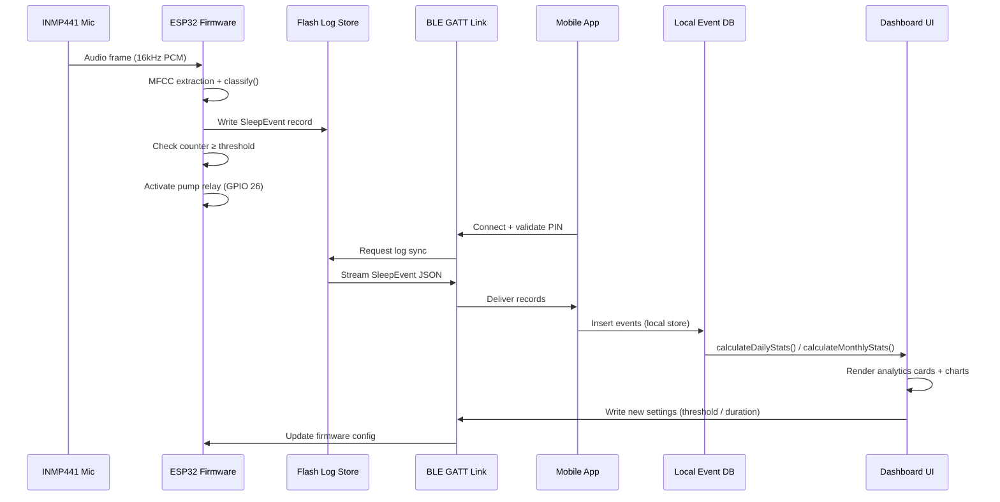

# HAGOKILLER — Prototype System & Step-by-Step Operation Guide

> A closed-loop IoT Smart Pillow that **automatically detects snoring** using Edge AI acoustic classification and **intervenes via air-bladder inflation** to restore airway patency — all synchronized to a React Native mobile app for analytics, trend reports, and device control.

---

## Table of Contents

1. [System Architecture Overview](#1-system-architecture-overview)
2. [Hardware Component List](#2-hardware-component-list)
3. [IoT Smart Pillow — Step-by-Step Operation](#3-iot-smart-pillow--step-by-step-operation)
4. [Mobile App — Step-by-Step Operation](#4-mobile-app--step-by-step-operation)
5. [BLE Communication Protocol](#5-ble-communication-protocol)
6. [Snore Severity Classification](#6-snore-severity-classification)
7. [Data Flow & Database Mapping](#7-data-flow--database-mapping)
8. [End-to-End Prototype Demo Walkthrough](#8-end-to-end-prototype-demo-walkthrough)
9. [Known Limitations & Future Improvements](#9-known-limitations--future-improvements)

---

## 1. System Architecture Overview

The HAGOKILLER prototype is a **closed-loop sleep monitoring and intervention system**:



---

## 2. Hardware Component List

| #   | Component                   | Role                                                   |
| --- | --------------------------- | ------------------------------------------------------ |
| 1   | **ESP32-WROOM-32**          | Main microcontroller — runs firmware, BLE, Edge AI     |
| 2   | **INMP441 MEMS Microphone** | I2S digital biosensor for acoustic snore capture       |
| 3   | **12V Miniature Air Pump**  | Inflates the internal air bladder on snore trigger     |
| 4   | **NC Solenoid Valve**       | Normally-closed valve; opens to slowly release air     |
| 5   | **Expandable Air Bladder**  | Embedded in pillow; lifts head to adjust airway angle  |
| 6   | **5V Relay Module (x2)**    | GPIO-controlled relay for pump and valve switching     |
| 7   | **12V DC Power Supply**     | Powers the pump and ESP32 (via buck converter to 3.3V) |
| 8   | **ESP32 Flash (4 MB)**      | Local sleep event log storage (90+ days of records)    |
| 9   | **USB-C / Micro-USB port**  | Firmware flashing and debugging interface              |
| 10  | **Status LED (RGB)**        | Visual feedback for BLE connection and pump activation |

---

## 3. IoT Smart Pillow — Step-by-Step Operation

### 3.1 Power-On & Boot Sequence

```
Step 1 ─ Power is connected (12V DC In)
Step 2 ─ ESP32 boots via bootloader (SPIFFS partition mounts flash log store)
Step 3 ─ I2S interface initializes INMP441 (sample rate: 16 kHz, 32-bit PCM)
Step 4 ─ BLE GATT Server starts advertising: "SmartPillow-ESP32"
Step 5 ─ RGB LED blinks BLUE (slow) = Waiting for mobile app connection
```

### 3.2 Mobile App BLE Pairing

```
Step 6 ─ User opens HAGOKILLER app and enters the 7-digit PIN on the device label
Step 7 ─ ESP32 validates PIN via BLE Characteristic write (UUID: 0x1234)
Step 8 ─ On success: RGB LED turns GREEN (solid) = Paired and syncing
Step 9 ─ ESP32 transmits stored flash log records to the mobile app via BLE notify
Step 10─ Mobile app stores events in local DB and renders dashboard
```

### 3.3 Real-Time Snore Detection Loop

```
Step 11─ Microphone streams audio frames to ESP32 (continuous 512-sample FFT windows)
Step 12─ Edge AI feature extraction: Mel-frequency cepstral coefficients (MFCCs)
Step 13─ Classifier output: "snore" | "non-snore" (threshold-based or CNN inference)
Step 14─ If "snore" → increment consecutive snore counter
Step 15─ If counter < THRESHOLD (default: 3) → continue monitoring (back to Step 11)
Step 16─ If counter ≥ THRESHOLD → trigger intervention (Step 17)
Step 17─ If "non-snore" → reset counter (back to Step 11)
```

### 3.4 Air Pump Inflation Intervention

```
Step 18─ GPIO Pin 26 pulls HIGH → Relay 1 closes → Air pump activates
Step 19─ Pump runs for PUMP_DURATION (default: 12s, range 5–30s)
Step 20─ Internal air bladder inflates → pillow height increases by ~2–4 cm
Step 21─ User's head is gently tilted, opening the nasopharyngeal airway
Step 22─ Snoring typically stops within 3–8 seconds of inflation
Step 23─ After PUMP_DURATION elapses: GPIO Pin 26 pulls LOW → Pump stops
```

### 3.5 Auto-Deflation After Intervention

```
Step 24─ GPIO Pin 27 pulls HIGH → Relay 2 opens solenoid valve
Step 25─ Trapped air slowly released via valve over 15–20 seconds
Step 26─ Pillow returns to resting height
Step 27─ GPIO Pin 27 pulls LOW → Valve closes
Step 28─ Snore counter resets → monitoring resumes (back to Step 11)
```

### 3.6 Event Logging to Flash Memory

At every detected snore, the ESP32 writes a structured record to flash:

| Field                   | Type                      | Example         |
| ----------------------- | ------------------------- | --------------- |
| `eventID`               | String (UUID)             | `event-0-3`     |
| `timestamp`             | Unix epoch (ms)           | `1752076800000` |
| `duration`              | Seconds                   | `42`            |
| `severity`              | `low` / `medium` / `high` | `medium`        |
| `interventionTriggered` | Boolean                   | `true`          |
| `interventionDuration`  | Seconds                   | `12`            |

---

## 4. Mobile App — Step-by-Step Operation

The mobile app runs on **React Native + Expo** with **React Navigation** (Stack + Bottom Tabs), **React Native Chart Kit**, and locally stored sleep data.

### 4.0 Mobile App Modules and Pairing Example

#### App structure

- `App.tsx` — app entry point. Hosts navigation, stores the current user profile state, and routes from loading → profile → pairing → main dashboard.
- `src/screens/LoadingScreen.tsx` — launch splash and initialization flow.
- `src/screens/NameInputScreen.tsx` — profile setup screen that captures user name, optional birthdate, and sleep-goal hours.
- `src/screens/PairingPinScreen.tsx` — secure device pairing module for entering the smart pillow PIN.
- `src/screens/DashboardScreen.tsx` — main analytics and sleep status dashboard.
- `src/screens/NightDetailScreen.tsx` — detailed night event timeline and session review.
- `src/screens/LogsScreen.tsx` — historical event log viewer with filters.
- `src/components/*` — reusable UI cards, charts, recommendation cards, and filter controls.
- `src/services/mockBLEService.ts` — mock BLE backend used in the prototype to simulate device sync and sleep-event streaming.
- `src/utils/*` — helper logic for PIN validation, recommendation generation, and stats calculation.
- `src/hooks/useFonts.ts` — font-loading helper used during startup.
- `src/types/*` — shared TypeScript type definitions for events, profiles, stats, and BLE data.

#### Pairing/Login module example

- This prototype uses a device pairing flow rather than email/password login.
- The user enters the 7-digit pillow pairing PIN on `PairingPinScreen.tsx`.
- `PairingPinScreen.tsx` validates the PIN format using `src/utils/pinValidation.ts`.
- After validation, it calls the `onPinSubmit(pin)` callback supplied by `App.tsx`.
- In the current app flow, `App.tsx` accepts the PIN and advances navigation from `PairingPin` to `Main`, then the main dashboard loads and BLE sync begins.
- This module is the gateway to the app: it ensures the user is connected to the correct smart pillow and prevents accidental device mismatch.

### 4.1 Loading & Splash Screen

**Screen:** [LoadingScreen.tsx](file:///c:/Users/HP/OneDrive/Documents/HAGOKILLER/src/screens/LoadingScreen.tsx)

```
Step 1 ─ App opens: animated branding splash with glowing pulse ring and "Zzz" animations
Step 2 ─ Progress bar advances through:
         ├─ "Initializing biosensor array…"      (0–25%)
         ├─ "Establishing BLE handshake…"        (25–60%)
         ├─ "Decrypting sleep event database…"   (60–85%)
         └─ "Calibrating analytics engine…"      (85–100%)
Step 3 ─ On complete → Navigate to Profile Setup
```

### 4.2 Profile Creation

**Screen:** [NameInputScreen.tsx](file:///c:/Users/HP/OneDrive/Documents/HAGOKILLER/src/screens/NameInputScreen.tsx)

```
Step 4 ─ User enters their full name in the text input field
Step 5 ─ (Optional) Taps "Birthdate" → Calendar modal opens (month/day/year scroll)
Step 6 ─ (Optional) Taps "Sleep goal" → Dropdown: 6h / 7h / 8h / 9h / 10h / Custom
Step 7 ─ Tap [Continue] → Profile stored: { name, birthdate, sleepGoalHours }
Step 8 ─ Navigate to Device Pairing
```

### 4.3 Secure Device Pairing

**Screen:** [PairingPinScreen.tsx](file:///c:/Users/HP/OneDrive/Documents/HAGOKILLER/src/screens/PairingPinScreen.tsx)

```
Step 9 ─ User locates the 7-digit PIN on the sticker beneath the smart pillow
Step 10─ Enters PIN in the 7-box secure input field (e.g. "1 2 3 4 5 6 7")
Step 11─ App validates PIN format (must be exactly 7 numeric digits)
Step 12─ Tap [Pair & Connect] → BLE handshake request sent to ESP32
Step 13─ ESP32 confirms PIN → BLE session established → Navigate to Main Dashboard
```

### 4.4 Main Dashboard — Analytics Tab

**Screen:** [DashboardScreen.tsx](file:///c:/Users/HP/OneDrive/Documents/HAGOKILLER/src/screens/DashboardScreen.tsx)

```
Step 14─ BLE data sync loads 90 days of sleep event records into local store
Step 15─ Dashboard renders the following cards:
         ├─ Snoring Events        (total count for selected period)
         ├─ Avg. Duration         (seconds per event)
         ├─ Interventions         (pillow inflation activations)
         ├─ Peak Hour             (e.g. "2AM" — most active snoring window)
         └─ Intervention Success  (% of interventions that stopped snoring)
Step 16─ Tap the filter bar to switch view: [Today] [7 Days] [Month] [Date Range]
         └─ Date Range: custom calendar modal with from/to date pickers
Step 17─ Line chart renders 7-day snore event trend
Step 18─ Hourly activity bar chart maps 0h–23h snore frequency distribution
Step 19─ Monthly Trend section shows 3-month comparison with ▲/▼ change indicators
```

### 4.5 Assessment Tab

```
Step 20─ Tap [Assessment] tab on the dashboard
Step 21─ System reads severity for the active time period:
         ├─ Normal   (0–3 events/day):  Green card — wellness tips
         ├─ Elevated (4–10 events/day): Amber card — lifestyle adjustments
         └─ Critical (11+ events/day):  Red card — medical referral warning
Step 22─ Recommendation card shows:
         ├─ Sleep Health Assessment header (severity-colored)
         ├─ Trend message (e.g. "Improving over time")
         ├─ Main clinical recommendation text
         ├─ Therapeutic Action Items list (3–5 steps)
         └─ Medical Disclaimer banner (critical severity only)
```

### 4.6 Logs & Device Settings Tab

```
Step 23─ Tap [Logs] tab on the dashboard
Step 24─ Device Parameter Settings panel:
         ├─ "Consecutive snore threshold" stepper (min: 1, max: 10)
         ├─ "Pump activation duration" stepper (min: 5s, max: 30s)
         └─ Tap [Save Device Settings] → BLE write command to ESP32
Step 25─ Sleep Event Logs list renders all events for selected date range
Step 26─ Sort logs by: Date | Severity | Duration
Step 27─ Swipe individual entries → Tap 🗑️ trash icon to delete from local store
```

### 4.7 Night Detail Timeline

**Screen:** [NightDetailScreen.tsx](file:///c:/Users/HP/OneDrive/Documents/HAGOKILLER/src/screens/NightDetailScreen.tsx)

```
Step 28─ On Analytics tab with "Today" filter, tap [View Nightly Detail Timeline]
Step 29─ Overlay screen renders a chronological timeline for the selected night:
         ├─ 10:30 PM ─ Sleep started
         ├─  1:15 AM ─ ⚠️ Snoring detected (medium, 42s)
         ├─  1:16 AM ─ 💨 Pillow inflated (12s intervention)
         ├─  1:17 AM ─ ✅ Snoring stopped
         ├─  2:03 AM ─ ⚠️ Snoring detected (high, 65s)
         └─  6:45 AM ─ Wake detected / session ended
```

---

## 5. BLE Communication Protocol

The ESP32 runs a **GATT Server** with the following characteristics:

| Service UUID | Characteristic UUID | Permission    | Description                                    |
| ------------ | ------------------- | ------------- | ---------------------------------------------- |
| `0xFF00`     | `0xFF01`            | READ / NOTIFY | Stream sleep event log records (JSON chunks)   |
| `0xFF00`     | `0xFF02`            | WRITE         | Receive device settings (threshold + duration) |
| `0xFF00`     | `0xFF03`            | WRITE         | Receive pairing PIN for authentication         |
| `0xFF00`     | `0xFF04`            | READ          | Device status (battery, signal, mode)          |

### Settings Write Payload Format

The app sends a JSON string over `0xFF02`:

```json
{
  "snoreThreshold": 3,
  "pumpDuration": 12
}
```

### Event Log Sync Format

The ESP32 sends events over `0xFF01` as JSON arrays (chunked by MTU size):

```json
[
  {
    "id": "event-0-3",
    "timestamp": 1752076800000,
    "duration": 42,
    "severity": "medium",
    "interventionTriggered": true,
    "interventionDuration": 12
  }
]
```

---

## 6. Snore Severity Classification

Severity is classified based on **snore event count per day** and **average event duration**:

| Severity Level | Events/Day | Avg. Duration | Pillow Status        | App Alert Color |
| -------------- | ---------- | ------------- | -------------------- | --------------- |
| **Normal**     | 0 – 3      | < 30s         | Rarely inflates      | 🟢 Green        |
| **Elevated**   | 4 – 10     | 30 – 60s      | Frequently inflates  | 🟡 Amber        |
| **Critical**   | 11+        | > 60s         | Inflates every cycle | 🔴 Red          |

### Monthly Trend Logic

The app compares the last 3 months' total snore counts:

| Comparison Result         | Trend Label | Icon           |
| ------------------------- | ----------- | -------------- |
| Month N < Month N-1       | `improving` | 📈 Green arrow |
| Month N ≈ Month N-1 (±5%) | `stable`    | ➖ Amber dash  |
| Month N > Month N-1       | `worsening` | 📉 Red arrow   |

---

## 7. Data Flow & Database Mapping



---

## 8. End-to-End Prototype Demo Walkthrough

Use these steps when demonstrating the prototype to reviewers or a panel:

| #   | Step                                             | Expected Result                                                      |
| --- | ------------------------------------------------ | -------------------------------------------------------------------- |
| 1   | Power on smart pillow                            | RGB LED blinks blue (BLE advertising)                                |
| 2   | Open app → Loading screen                        | Progress bar completes, enters Profile screen                        |
| 3   | Enter name + sleep goal                          | Profile card accepted; moves to Pairing screen                       |
| 4   | Enter 7-digit PIN                                | BLE handshake succeeds; LED turns green; Dashboard loads             |
| 5   | View Dashboard → Analytics tab                   | Stats cards render; 7-day chart and hourly bar chart visible         |
| 6   | Tap Simulation Override → "Critical"             | Warning banner appears; stats jump to 11+ events; red severity badge |
| 7   | Switch to Assessment tab                         | Clinical recommendation + red danger banner visible                  |
| 8   | Switch to Logs tab → change threshold to 2       | Stepper decrements; tap Save → BLE write simulated                   |
| 9   | Return to Analytics, set filter to Today         | Tap "View Nightly Detail Timeline" → NightDetailScreen opens         |
| 10  | Set filter to "Date Range" → Select custom dates | Calendar modal opens; filtered stats update after Apply              |
| 11  | Demonstrate Month filter                         | 3-month trend cards render with ▲/▼ change badges                    |
| 12  | Sort logs by Severity                            | Log list reorders from high → medium → low                           |
| 13  | Delete a log entry                               | Entry animates out of list                                           |
| 14  | Tap Settings icon (⚙️)                           | Device status modal opens (battery, signal, pairing status)          |

---

## 9. Known Limitations & Future Improvements

| Limitation                                        | Status    | Planned Fix                                         |
| ------------------------------------------------- | --------- | --------------------------------------------------- |
| BLE is mocked (`MockBLEService`)                  | Prototype | Integrate `react-native-ble-plx` for real BLE       |
| Sleep event data is pre-generated (90-day mock)   | Prototype | Replace with live GATT notify stream from ESP32     |
| Edge AI classifier uses threshold-based detection | v1        | Train lightweight CNN (TensorFlow Lite for ESP32)   |
| No cloud sync or user account system              | v1        | Add Supabase / Firebase cloud backup option         |
| No apnea detection (only snoring)                 | v1        | Add SpO₂ sensor (MAX30102) for oxygen dip detection |
| Single-user profile per device                    | v1        | Support multi-profile household pairing             |
| Air bladder deflation is passive (gravity-fed)    | v1        | Add active vacuum/deflation pump for faster reset   |
